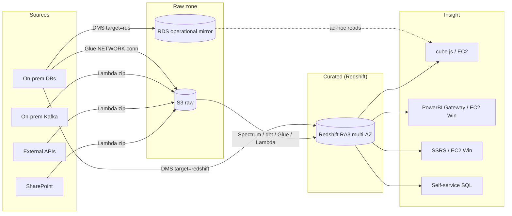
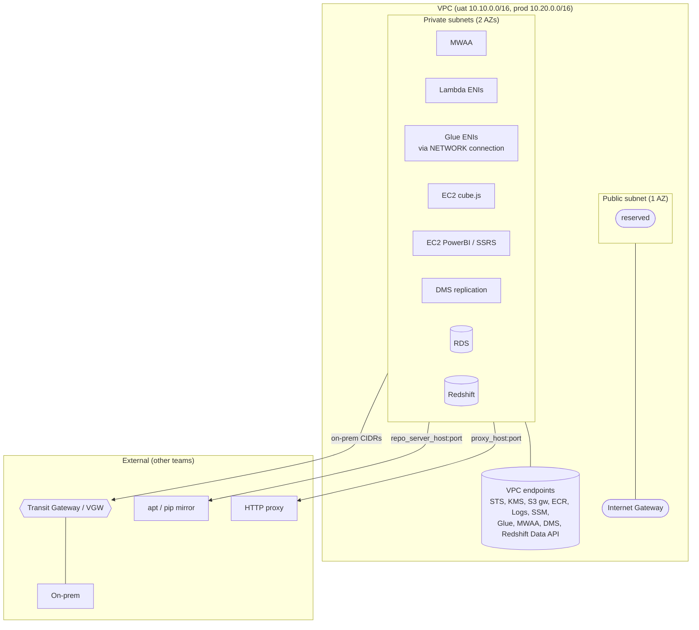
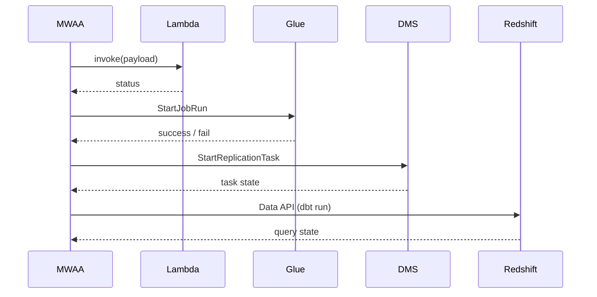

# Architecture

High-level view of the `vpbs-eda` cloud data platform, v0 (AWS `ap-southeast-1`).

## Logical layers

## AWS topology (per environment)

## MWAA-driven orchestration

## Decision log

Confirmed decisions live as ADRs under [`docs/adr/`](./adr/).

| # | Title |
|---|---|
| 0001 | IaC stack — Terraform + Terragrunt |
| 0002 | Environment & account topology — uat + prod separate accounts |
| 0003 | On-prem connectivity model — consume externally-managed VPN/DX |
| 0004 | Warehouse engine — Redshift RA3 multi-AZ provisioned |
| 0005 | DMS routing — per-source target (Redshift or RDS) |
| 0006 | MWAA webserver — public + IAM Identity Center auth |
| 0007 | Resource naming convention — `<org>-<dep>-<env>-<region>-<resource>` |
| 0008 | Subnet design — 1 public + 2 private (no isolated tier) |
| 0009 | Terraform state backend — S3 only, native locking, no DynamoDB |
| 0010 | Lambda packaging — Python zip, no container images |
| 0011 | Scheduling — MWAA only, no EventBridge cron |
| 0012 | Encryption — AWS-managed default KMS keys at v0 |
| 0013 | Glue VPC attachment — `NETWORK` connections, no JDBC connections |
